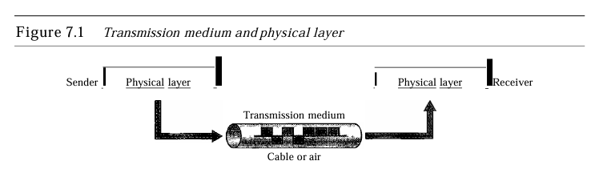
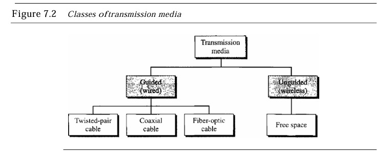
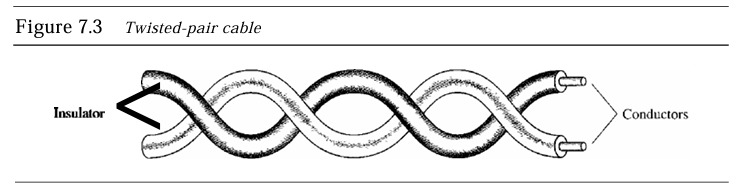
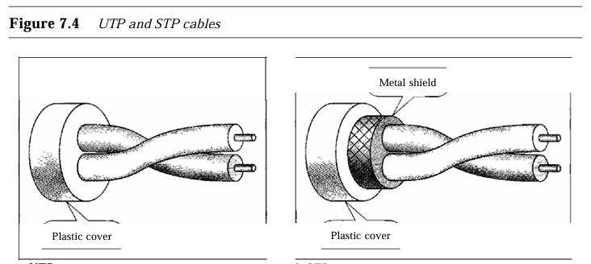
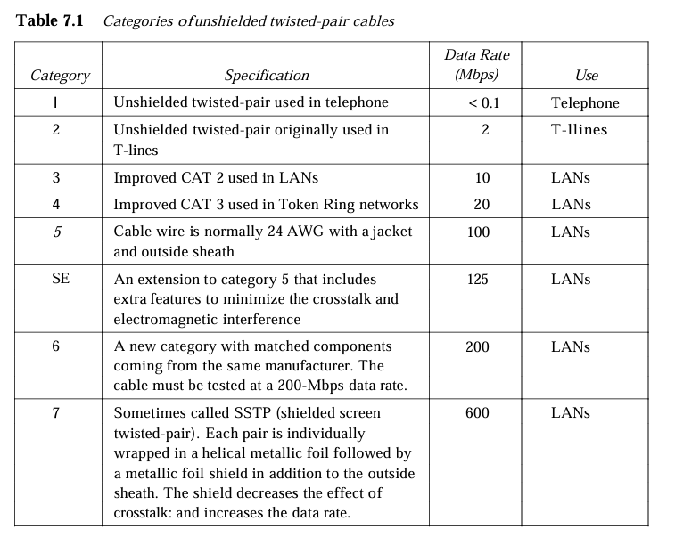
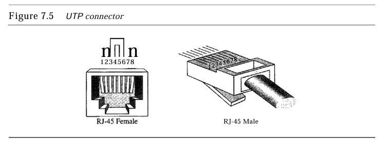
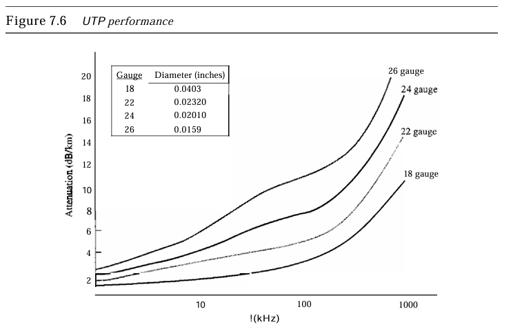
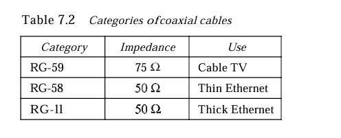
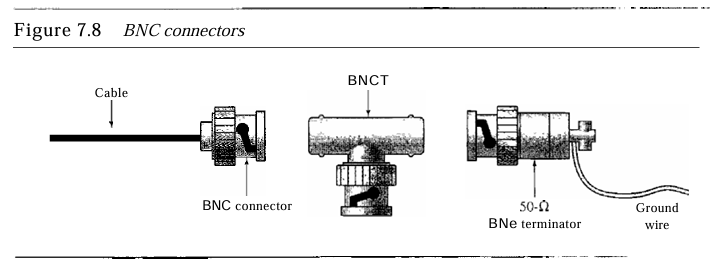
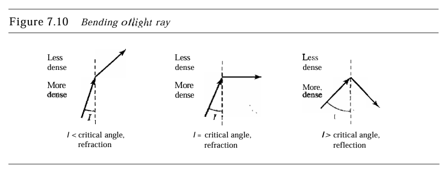

# Medios de Transmision
## capitulo 7
JUAN MIGUEL LEON CUPUL

## Definición de medios de transmisión

Un medio de transmisión se define como cualquier cosa que pueda llevar información desde un origen a destino. El medio de transmisión suele ser el espacio libre, un cable metálico o un cable de fibra óptica.

  

## Clasificacion de los medios de Transmision
Los dispositivos de telecomunicaciones utilizan **señales electromagnéticas** para transmitir datos a través de medios de transmisión en dos categorías:
- **Medios guiados**: Incluyen cables de par trenzado, cable coaxial y cable de fibra óptica.
- **Medios no guiados**: Consisten en el espacio libre.

# Clases de medio de transmision

  

# 7.1 Medio guiado

Medios físicos que dirigen señales entre dispositivos:

- **Par Trenzado**: Cables de cobre que transportan señales eléctricas.
- **Coaxial**: Cables metálicos para señales eléctricas.
- **Fibra Óptica**: Cables que transmiten señales de luz.

# Cable par trenzado 

Un par trenzado consiste en dos conductores (normalmente de cobre), cada uno con su propio aislamiento plástico, trenzados juntos, como se muestra en la Figura 7.3.

  

- En cables de **par trenzado**, un cable lleva la señal y el otro sirve como referencia de tierra; el receptor utiliza la diferencia entre ambos.**Trenzar los cables** ayuda a equilibrar las interferencias (ruido y diafonía), ya que ambos cables son afectados por igual.Las señales no deseadas se **cancelan en su mayoría** en el receptor.El **número de torsiones** por unidad de longitud influye en la calidad del cable.

## Par Trenzado Sin Blindaje (UTP) vs. Blindado (STP):

UTP: El tipo más común en comunicaciones; sin protección adicional.
STP: Incluye una cubierta metálica que reduce el ruido y la diafonía, pero es más voluminoso y costoso. Usado principalmente por IBM.

## Categorías de UTP:

Establecidas por la Asociación de Industrias Electrónicas (EIA).
Clasificadas de Categoría 1 (calidad más baja) a Categoría 7 (calidad más alta).
Cada categoría es adecuada para usos específicos.

## Conectores UTP:

RJ45: Conector más común; es un conector con llave que solo se inserta de una manera.
  

### Cables UTP Y STP 

## **Categorías de cables de par trenzado sin blindaje** 

# **Rendimiento**

- La **atenuación** en cables de par trenzado aumenta con la **frecuencia**, especialmente por encima de **100 kHz**.Se mide en **decibelios por kilómetro (dB/km)**.Aunque pueden transmitir un amplio rango de frecuencias, el rendimiento disminuye a frecuencias más altas. El **calibre** del cable (grosor) influye en su rendimiento.

## Conector UTP

## Rendimiento del cable UTP
 

### Cable coaxial
El cable coaxial transporta señales de frecuencias más altas que el cable de part trenzado debido a su distinta construccion, el conductor central es de alambre solido o trenzado de cobre, cuenta con aislante interno y externo, junto a la cubierta plástica.

 

### Estándares de Cable Coaxial (RG)
Clasificación RG, cada número RG indica especificaciones físicas específicas, sus carácterísticas son del tamaño del calibre, grosor del aislante, cubierta extrema, cada RG tiene un uso especifico

### Conectores de cable coaxial
Para conectar el cable coaxial a dispositivos, se utilizan conectores coaxiales. El conector más común es el Bayone-Neill-Concelman (BNC), con tres tipos populares: el **BNC conector**, para conectar el cable a un dispositivo como una TV; el **BNC T conector**, usado en redes Ethernet para ramificar conexiones; y el **BNC terminador**, que se coloca al final del cable para evitar la reflexión de la señal.

### Aplicaciones
El cable coaxial, antes común en redes telefónicas analógicas y digitales para transmitir múltiples señales de voz y datos a alta velocidad, ha sido en gran medida reemplazado por la **fibra óptica**.

El **cable coaxial** se usó ampliamente en redes telefónicas analógicas, transportando hasta **10,000 señales de voz**. En redes digitales, soportaba datos de hasta **600 Mbps**, aunque ha sido reemplazado por **fibra óptica**. También es común en redes de **TV por cable**, donde inicialmente toda la red era coaxial, aunque los proveedores han comenzado a cambiar a nuevas tecnologías.

El **cable coaxial** en **TV por cable** se ha reemplazado en su mayoría por **fibra óptica**, excepto cerca del cliente (RG-59). En **Ethernet LAN**: el **10Base-2** usa RG-58 para 10 Mbps en 185 m, y el **10Base-5** usa RG-11 para 10 Mbps en 500 m.

### Fibra Óptica
- **Descripción**: Formada por un núcleo de vidrio o plástico que transmite señales de luz en lugar de señales eléctricas.
- **Principio de Funcionamiento**: Utiliza la reflexión interna total para guiar la luz a través del núcleo.
- **Ventajas**: Alta resistencia a interferencias electromagnéticas, menor atenuación de la señal y mayor capacidad de ancho de banda.
- **Aplicaciones**: Redes de largo alcance, como el backbone de internet, redes de televisión por cable y redes Ethernet de alta velocidad.

  

## Modos de Propagación en Fibra Óptica
1. **Multimodo**: Permite múltiples trayectorias para la luz, ideal para distancias cortas y medianas. Se divide en:
   - **Índice escalonado**: El núcleo tiene una densidad uniforme, lo que puede distorsionar las señales.
   - **Índice graduado**: La densidad disminuye gradualmente hacia el borde, reduciendo la distorsión.

## 2. **Monomodo**: Usa un núcleo estrecho que permite solo una trayectoria, reduciendo la distorsión y facilitando transmisiones a largas distancias con mayor precisión.

## Ventajas y Desventajas de la Fibra Óptica
- **Ventajas**:
  - Alta capacidad de ancho de banda, ideal para transmisión de datos masivos.
  - Menor atenuación, permitiendo cubrir distancias largas sin repetidores.
  - Inmunidad a interferencias electromagnéticas, lo que mejora la seguridad y la calidad de la transmisión.
- **Desventajas**:
  - Requiere dos fibras para comunicación bidireccional.
  - Coste elevado y necesidad de técnicos especializados para su instalación y mantenimiento.

# Medios No Guiados (Inalámbricos)

### Ondas de Radio
- **Propiedades**: Son omnidireccionales, propagándose en todas las direcciones.
- **Ventajas**: No requiere alineación entre antenas y pueden atravesar paredes.
- **Aplicaciones**: Transmisión de AM y FM, televisión y comunicaciones marítimas.

### Microondas
- **Características**: Son unidireccionales y requieren antenas alineadas para transmisión punto a punto.
- **Ventajas**: Alta capacidad de ancho de banda, adecuada para comunicaciones unicast.
- **Aplicaciones**: Redes celulares, satélites y redes LAN inalámbricas.

### Infrarrojo
- **Descripción**: Utiliza frecuencias altas que no penetran paredes, limitando la señal a áreas específicas.
- **Aplicaciones**: Control remoto, teclados inalámbricos y comunicación de dispositivos en interiores.
- **Limitaciones**: Ineficiente para comunicación a larga distancia y sensible a la luz solar.

## Métodos de Propagación en Medios No Guiados
1. **Propagación en Tierra**: Onda que sigue la curvatura de la Tierra, usada en comunicaciones de baja frecuencia.
2. **Propagación en el Cielo**: La onda se refleja en la ionósfera, permitiendo transmisión a largas distancias.
3. **Propagación en Línea de Vista**: Usada para frecuencias altas; requiere antenas alineadas para transmisión directa.

  

